# P5.3 - Informe RA3 sobre el despliegue (WildFly contenedor + Gradle)

## Preguntas

### a) Componentes y funcionamiento de los servicios del servidor

1. **Explica qué componentes/servicios intervienen en tu despliegue de P5.2 y qué papel tiene cada uno (como mínimo: contenedor Docker, WildFly, aplicación WAR,puertos 8080/9990 y endpoint REST). Ten en cuenta el punto c) sobre el servidor web frontal.**

    - **WildFly**: Es un servidor de aplicaciones que provee el entorno de ejecución Jakarta EE 10. Gestiona el ciclo de vida de los Servlets, inyección de dependencias y la API REST (Jakarta REST). Internamente tiene un servidor web (Undertow) que escucha en el puerto 8080.
    - **Contenedor WildFly** (imagen: "quay.io/wildfly/wildfly:latest"): Servicio aislado con Docker que ejecuta el servidor de aplicaciones.
    - **Aplicación WAR**: Paquete de la aplicación que contiene las clases, la interfaz mediante su index.html. 
    - **Puertos utilizados (mapeados al host)**:
        - 8080: Tráfico HTTP de la aplicación.
        - 9990: Consola de administración de WildFly.
    - **API REST** CRUD de tareas, tiene estos endpoints: 
        - `GET /app/api/tasks`
        - `GET /app/api/tasks/{id}`
        - `POST /app/api/tasks`
        - `PUT /app/api/tasks/{id}`
        - `DELETE /app/api/tasks/{id}`

2. **Describe el flujo de una petición desde el cliente hasta tu endpoint.**

El cliente realiza una petición HTTP a la URL "http://localhost:8080/app/api/tasks", el tráfico llega inicialmente al puerto 8080 del host, donde Docker actúa como intermediario redirigiendo el paquete de red hacia el puerto 8080 interno del contenedor WildFly. Una vez dentro del contenedor, Undertow intercepta la solicitud y basándose en la configuración del archivo jboss-web.xml incluido en el WAR identifica el contexto raíz /app para enrutar el tráfico hacia el despliegue específico de la aplicación. Después, el framework Jakarta REST analiza la ruta restante, ejecuta el endpoint elegido y devuelve la respuesta en formato JSON al cliente.

#### Evidencias

- `docker ps` mostrando el contenedor y los puertos publicados.

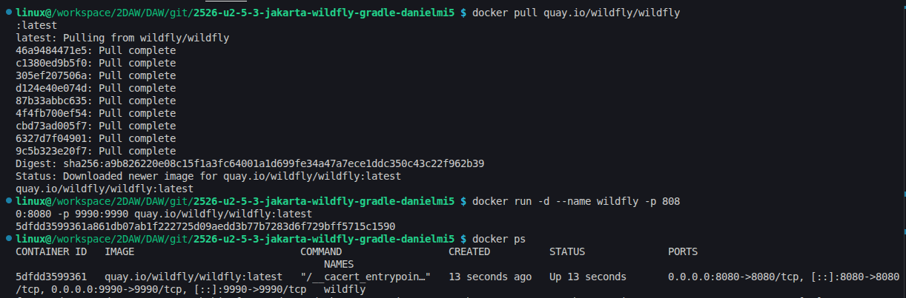

- `docker logs -f wildfly` mostrando el despliegue y el acceso.

    - Logs iniciales del contenedor
        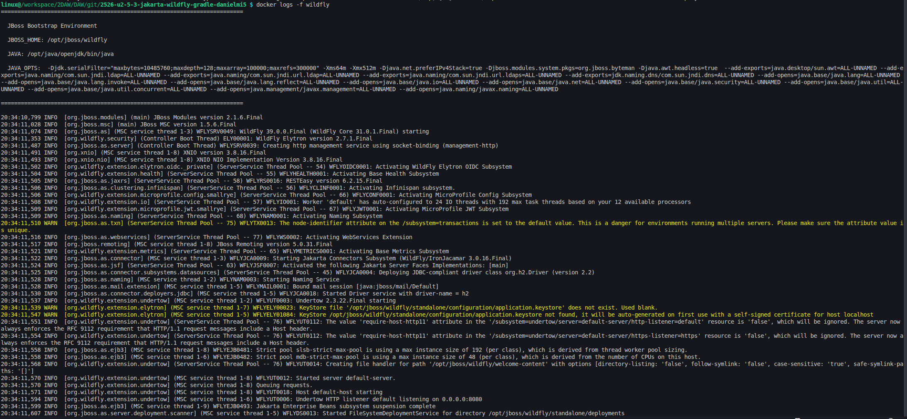

    - Logs al realizar el despliegue del WAR
        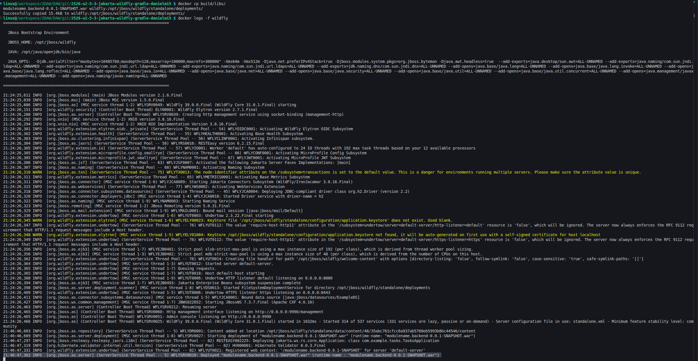

- Respuesta del endpoint (`curl`).


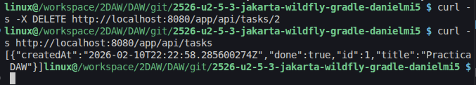


### b) Archivos principales de configuración y bibliotecas compartidas

1. **Identifica dentro de WildFly (en el contenedor) el/los archivo(s) de configuración principal(es) que gobiernan el servidor y señala.**

	- Donde están: Los archivos de configuración principales de se encuentran en la carpeta `/opt/jboss/wildfly/standalone/configuration/`

    
    
    - Qué tipo de ajustes podrías tocar ahí para tu despliegue: Se puede cambiar los puertos que se utilizan, configurar datasource pa utilizar una base de datos diferente o configurar el nivel de detalle de los logs.

    

2. **Explica qué dependencias de tu proyecto se consideran “provided” porque el servidor ya las incluye, y qué ventaja tiene esto.**

    Solamente compileOnly, indica que la librería solo se usa para compilar. Esto hace que no empaquete en el WAR, reduciendo el tamaño del archivo y evitando errores por conflictos.
    
    ```kotlin
        dependencies {
            compileOnly("jakarta.platform:jakarta.jakartaee-api:10.0.0")
        }
    ```

    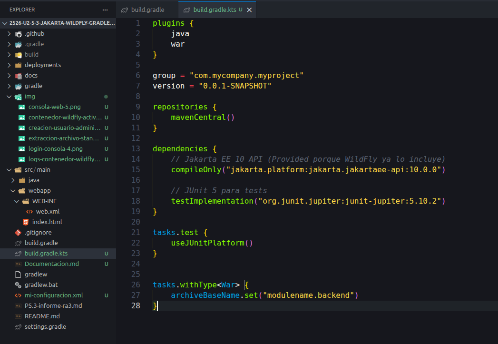


### c) Cooperación con el servidor web (proxy / reverse proxy) y https

1. **Plantea una configuración de reverse proxy para tu despliegue de P5.2 que publique la API bajo una ruta clara (por ejemplo /api/) y no exponga el puerto 9990 hacia fuera. Incluye un ejemplo de configuración (fragmento) y explica qué cambia respecto a tu despliegue actual.**

    Para el despliegue solo publicaría solo el puerto 8080 porque es donde funciona la aplicación y necesita ser expuesta para que el usuario la vea y utilice. Y cerraría el puerto 9990 para que ningún usuario no deseado pueda acceder a la consola de administración.

    La configuración del proxy inverso utilizaría nginx con esta configuración:
    ```
    server {
        listen 80;
        server_name app-tasks.com;

        location /api/ {
            proxy_pass http://wildfly:8080/app/api/;
            proxy_set_header Host $host;
            proxy_set_header X-Real-IP $remote_addr;
        }

        location /management {
            deny all;
        }
    }
    ```

    De esta manera el servidor escucha en el puerto 8080, redirigiría el tráfico de la API a WildFly. Además para no exponer el puerto 9990 se puedo denegar todo el tráfico a esa ruta con "deny all". Ahora, en el comando docker run no haría falta mapear los puertos.

2. **Realiza una configuración de TLS (HTTPS) en el servidor web frontal y explica qué ventajas aporta esto. ¿Cambiaría algo en tu aplicación o en la configuración de WildFly?**

    Respecto a la configuración anterior sin TLS, el cambio principal es que ahora nginx escucha en el puerto 443 con SSL habilitado en lugar del puerto 80 sin cifrado. Se han añadido los certificados SSL y las directivas de protocolo TLS para establecer una conexión segura. También se incluye un segundo bloque server que escucha en el puerto 80 y redirige automáticamente todo el tráfico HTTP a HTTPS mediante un código 301. Esto garantiza que todas las conexiones sean seguras incluso si el usuario intenta acceder por HTTP. Además, se ha añadido la cabecera X-Forwarded-Proto en el proxy_pass para que WildFly pueda identificar que la conexión original del cliente era HTTPS, lo cual es importante si la aplicación necesita generar enlaces absolutos.

    Configuración:
    ```
    server {
        listen 443 ssl;
        server_name localhost;

        ssl_certificate /etc/nginx/certificados/nginx-selfsigned.crt;
        ssl_certificate_key /etc/nginx/certificados/nginx-selfsigned.key;
        ssl_protocols TLSv1.2 TLSv1.3;
        ssl_prefer_server_ciphers on;

        location /api/ {
            proxy_pass http://wildfly:8080/app/api/;
            proxy_set_header Host $host;
            proxy_set_header X-Real-IP $remote_addr;
            proxy_set_header X-Forwarded-Proto $scheme;
        }

        location /console {
            deny all;
        }
    }

    # Redirige HTTP a HTTPS
    server {
        listen 80;
        server_name localhost;
        return 301 https://$server_name$request_uri;
    }
    ```

    Configurar TLS en nginx permite el cifrado de extremo a extremo entre el cliente y el proxy. Esto mejorar la seguridad general de la aplicación, protegiendo los datos. También aumentaría la confianza de los usuarios al ser seguro y cumpliría los estándares actuales. En la aplicación no hay ningún cambio aparente, pero habría que configurar para poder leer cabeceras X-Forwarded-Proto si se generan enlaces absolutos.


### d) Mecanismos de seguridad del servidor de aplicaciones

1. **Indica qué medidas de seguridad aplicaste en P5.2**

    Usé un usuario de gestión mediante `add-user.sh`. Además al utilizar Wildfly, mediante el contenedor Docker, aumenta la seguridad en mi máquina local al tener el entorno aislado.

2. **Indica qué medidas añadirías para producción (mínimo 4), justificando cada una.**

	1. Deshabilitaría la exposición pública del puerto 9990 para que no se pueda acceder públicamente a la consola de administración a usuarios no deseados.
    2. Para la gestión de secretos, usaría variables de entorno en un archivo .env o github secrets para no pasar datos sensibles.
    3. Habilitaría HTTPS para cifrar todo el tráfico y aumentar la seguridad.
    4. Logs más robustos y específicos para monitorización de seguridad, esto permitiría poder encontrar fallos de seguridad lo más pronto posible para evitar daños graves.
    5. Implementaría un proxy inverso para no exponer Wildfly directamente y proteger más la aplicación.

#### Evidencias

- Captura de puertos expuestos.

    

- Captura de que la consola solo es accesible internamente (solo es accesible internamente si no se usa el parámetro `-bmanagement 0.0.0.0`).

    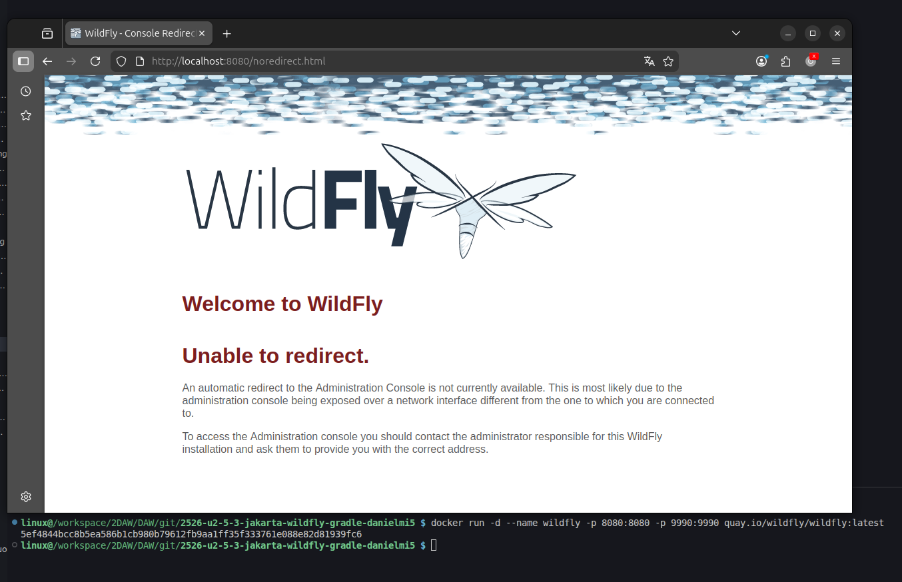


### e) Componentes web del servidor de aplicaciones

1. **Explica cómo se engancha la aplicación REST a WildFly en P5.2:**

	- Qué es el WAR y qué contiene a alto nivel.  
        Es una archivo comprimido que tiene los archivos necesarios para desplegar la aplicación. Contiene las clases en "WEB-INF/classes" y también, contiene index.html, web.xml y jboss-web.xml.
    - Qué significa el contexto/ruta base de la app.  
        Es la raíz que va a tener la url, se configura en `src/main/webapp/WEB-INF/jboss-web.xml` donde se define la ruta que va a seguir (/app):
        ```xml
        <?xml version="1.0" encoding="UTF-8"?>
        <jboss-web>
            <context-root>/app</context-root>
        </jboss-web>
        ``` 
    - Qué parte del servidor se encarga de servir la API (contenedor web)   
        Dentro de Wildfly, se encarga el subsistema Undertow actuando de contenedor web. Escucha en el puerto 8080 y lee los archivos XML al desplegar y también, inicia los endpoints.

2. **Incluye una URL real de tu práctica y desglósala (host, puerto, contexto, ruta del recurso).**

    URL --> `http://localhost:8080/app/api/tasks`

    - **Protocolo**: `http` (sin cifrado)
    - **Host**: `localhost`.
    - **Puerto**: `8080` (expuesto por Docker).
    - **Contexto base**: `/app` (definido en `jboss-web.xml`).
    - **Ruta Jakarta REST**: `/api` (definido con @ApplicationPath("/api") en TasksApplication.java).
    - **Recurso**: `/tasks` (definido con @Path("/tasks") en TaskResource.java).

#### Evidencias

- URLs probadas en navegador/curl.  
    Ejemplo con curl:
    
- Log del servidor mostrando el acceso. Los logs que aparecen son las operaciones que va realizando y en el log aparece: donde y que está haciendo.
    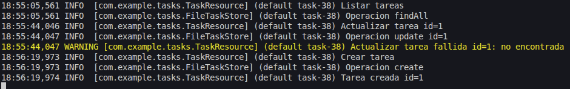

### f) Parámetros necesarios para el despliegue

1. **Enumera y justifica los parámetros que fueron necesarios en tu despliegue de P5.2 (mínimo 5).**
    Comando --> `docker run -d --name wildfly -p 8080:8080 -p 9990:9990 quay.io/wildfly/wildfly:latest /opt/jboss/wildfly/bin/standalone.sh -b 0.0.0.0 -bmanagement 0.0.0.0`


    1. `-d` (detached mode): Ejecuta el contenedor en segundo plano.
    2. **`--name wildfly`:** Asigna el nombre "wildfly" al contenedor.
    3. `-p 8080:8080` y `-p 9990:9990`: Mapeo de puertos (Host:Contenedor).
    4. `quay.io/wildfly/wildfly:latest`: Indica la imagen a utilizar.
    5.  `/opt/jboss/wildfly/bin/standalone.sh`: Comando de inicio (lo inicia en modo standalone).
    6.  **`-b 0.0.0.0`:** Binding de la interfaz pública (aplicaciones), acepta conexiones desde cualquier dirección IP.
    7.  **`-bmanagement 0.0.0.0`:** Igual que el anterior, pero para la interfaz de gestión.

2. **Explica qué pasaría si uno de esos parámetros estuviera mal.**

    Por ejemplo si `-b 0.0.0.0` estuviera mal, WildFly arrancaría normal, pero rechazaría todas las conexiones externas. En caso de que cualquier parametro estuviera mal sintácticamente, el comando fallaría.

    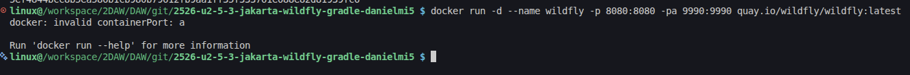

### g) Pruebas de funcionamiento y rendimiento

1. **Describe qué pruebas funcionales hiciste en P5.2 y aporta evidencias.**

    He probado el funcionamiento mediante peticiones con curl (todos los endpoints probados de la aplicación) y navegador (utilicé el endpoint para listar las tareas):

    
    
    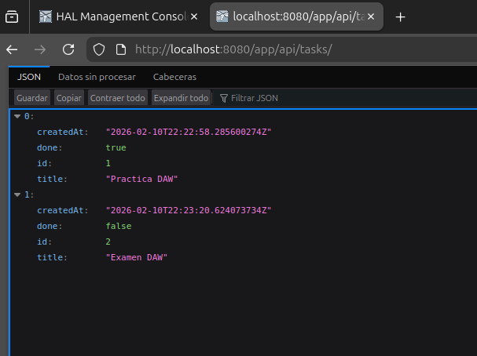


2. **Ejecuta una prueba de rendimiento básica (elige una: ab (ApacheBench), hey o wrk) e incluye el comando utilizado, el endpoint probado y un breve análisis del resultado (latencia, peticiones/segundo o errores).**

    Realicé la prueba de rendimiento con wrk mediante el comando `wrk -t4 -c100 -d10s http://localhost:8080/modulename.backend-0.0.1-SNAPSHOT/app/api/tasks`.

    Resultado del análisis:
    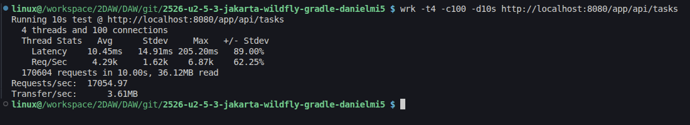

    - `-t4`: Número de hilos de ejecución (4).
    - `c100`: Número de conexiones HTTP mantenidas abiertas simultáneamente (100).
    - `d10s`: Duración de la prueba (10s).
    - `http://localhost:8080/modulename.backend-0.0.1-SNAPSHOT/app/api/tasks`: Endpoint utilizado.

    Durante la prueba, aparecen estos logs: 

    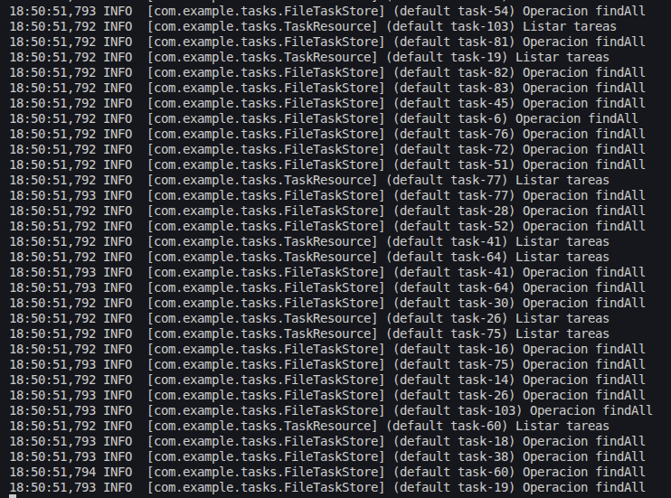

### h) Documentación de administración y recomendaciones

**Redacta una mini-guía de administración para tu despliegue de P5.2 que incluya (Debe ser reproducible para otra persona del equipo.):**

1. Cómo levantar WildFly.
2. Cómo desplegar una nueva versión del WAR.
3. Cómo comprobar el estado (logs y endpoint de prueba).
4. Recomendaciones para evitar errores comunes.


#### Evidencias

- Manual con instrucciones claras y paso a paso, acompañado de: 
- Ficheros Docker: dockerfile y compose. 
- Arquitectura de desplieuge 
- Comandos clave (docker, despliegue, pruebas). 
- URLs de prueba. 
- Acceso a logs y endpoints. 
- Pruebas de funcionamiento. 
- Pruebas de rendimiento. 
- Recomendaciones de seguridad.


### i) Virtualización, nube o contenedores en el despliegue

**Realiza un despliegue haciendo uso de docker compose que auné todo. Servidor web (Nginx) + servidor de aplicaciones (WildFly) + tu aplicación REST.**

Ten en cuenta volúmenes para logs, secretos, healthchecks y reinicio automático, limitación de recursos, redes, etc.

Una mejora adicional, sería separar frontend y backend en contenedores distintos, con comunicación entre ellos, y no exponer el backend directamente al host.

#### Evidencias


## Documentación utilizada

- [https://docs.wildfly.org/](https://docs.wildfly.org/)
- [https://quay.io/repository/wildfly/wildfly?tab=info](https://quay.io/repository/wildfly/wildfly?tab=info)